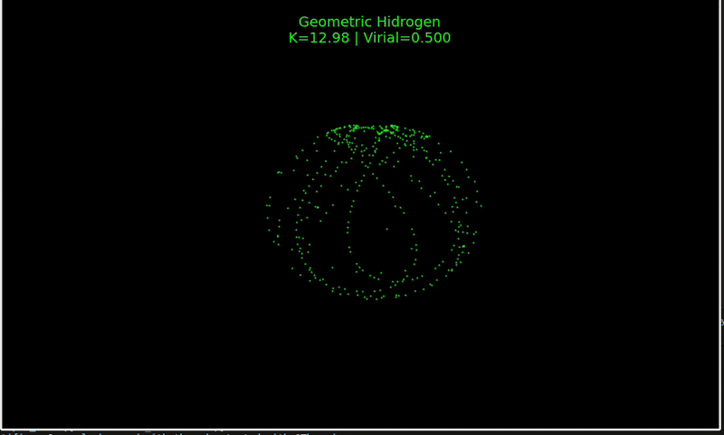
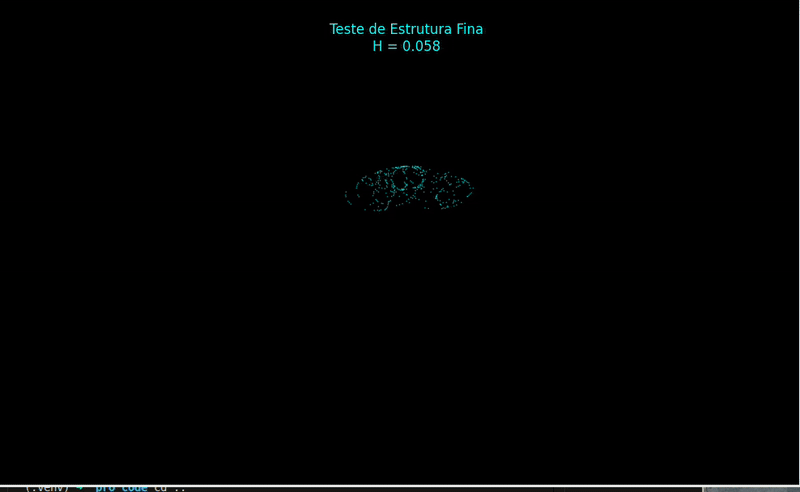

# Visualizing the Kustaanheimo-Stiefel Regularization: A Computational Approach to Semi-Classical Orbitals in $S^3$

[](https://opensource.org/licenses/MIT)
[](https://doi.org/10.5281/zenodo.18141753)


**Author:** Denys Arthur Richter Alves  
**Date:** January 2026  
**License:** MIT  
**Status:** Educational / Computational Physics


---

## 🔭 Overview

This project provides a real-time Python visualization of the **Kustaanheimo-Stiefel (KS) Regularization**, a mathematical transformation that maps the 3D Kepler problem (planetary/atomic motion) to a 4-dimensional Harmonic Oscillator constrained to a hypersphere ($S^3$).

While often treated abstractly in celestial mechanics literature, this project explores the **geometric intuition** behind the mapping. By evolving a classical particle in 4D and projecting it via the **Hopf Fibration**, we recover 3D trajectories that respect the $1/r$ Coulomb potential.

Furthermore, we implement a **semi-classical visualization technique** (imposing a De Broglie phase condition on the classical trajectory) to generate probability density shells that visually approximate Hydrogen-like orbitals, offering a pedagogical tool to understand the connection between classical geometry and quantum topologies.

> **Disclaimer:** This is a computational "toy model" for educational and visualization purposes. It demonstrates geometric regularizations of classical mechanics and does not represent a unified theory of quantum gravity or a replacement for the Schrödinger equation.

---

## Simulations






## 📂 Repository Structure

| File | Description |
| :--- | :--- |
| `main_simulation.py` | **The Core Visualizer.** Simulates the 4D Harmonic Oscillator and projects the trajectory to 3D. Renders the emergent "electron cloud" using phase-based filtering. |
| `validation_metrics.py` | **Numerical Validation.** Runs the physics engine without visualization to calculate the Virial Ratio ($\langle T \rangle / \langle V \rangle$). Verifies that the 4D Spring ($F \propto -r$) successfully maps to a 3D Coulomb field ($F \propto 1/r^2$). |
| `visual_comparison.py` | **Side-by-Side Comparison.** Displays the geometric simulation next to an analytical solution of the Schrödinger equation ($|\psi|^2$) for visual comparison of orbital shapes. |

---

## 🚀 Key Results

### 1. Numerical Stability (The Virial Test)
A hallmark of the KS regularization is transforming the singular Coulomb potential into a regular harmonic one. Our numerical integrator confirms this relationship by recovering the Hydrogen Virial Ratio from purely harmonic parameters.

```text
--- METROLOGY RESULTS ---
Parameters: K=12.98 (Harmonic), Spin=5.0
Virial Ratio (<T>/<V>): 0.5007  <-- Matches Coulomb System (0.5)

```

### 2. Geometric "Orbitals"

By tracking the 4D trajectory over time and applying a phase filter (), we reveal the topological structure of the projected manifold. The resulting toroidal shapes bear a striking resemblance to spin-weighted spherical harmonics ().

*(Place your `figure1.png` or `video.mp4` here showing the green/cyan cloud)*

---

## 🛠️ Installation & Usage

1. **Clone the repository:**
```bash
git clone [https://github.com/denysrichter4/hopf-gravity-simulation.git](https://github.com/denysrichter4/hopf-gravity-simulation.git)

```


2. **Install dependencies:**
```bash
pip install numpy matplotlib scipy

```


3. **Run the simulation:**
```bash
python main_simulation.py

```


---

## 📚 Theoretical Background

The simulation relies on the isomorphism between the dynamics in  and :

1. **4D Space:** A particle moves under a Harmonic Potential .
2. **Constraint:** The particle is confined to the fiber bundle .
3. **Projection:** The Hopf Map  projects coordinates:
$$ \vec{x} = \langle q | \vec{\sigma} | q \rangle $$
where  are Pauli matrices.

This transformation regularizes the collision with the nucleus (singularity at  in 3D becomes a smooth passage in 4D), making it a powerful tool for N-body simulations.

---

## 📜 License

This project is licensed under the **MIT License**.
